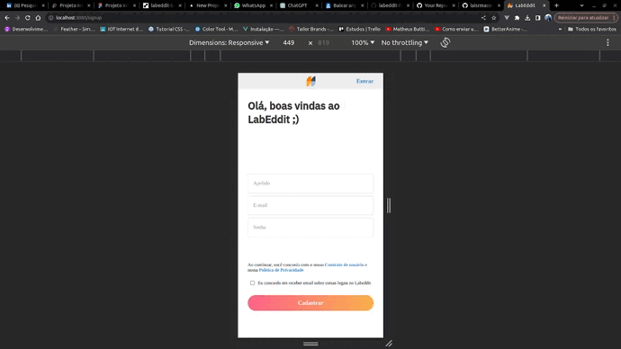
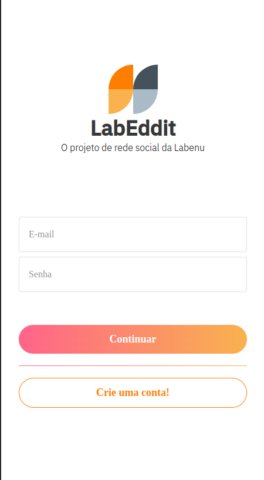
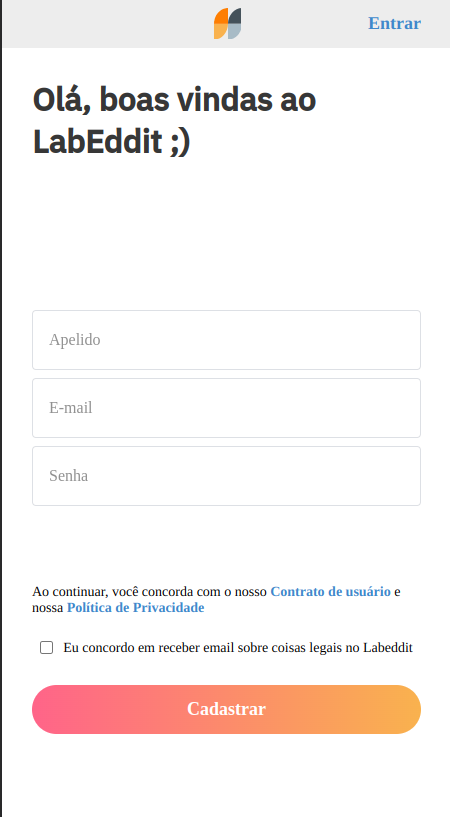
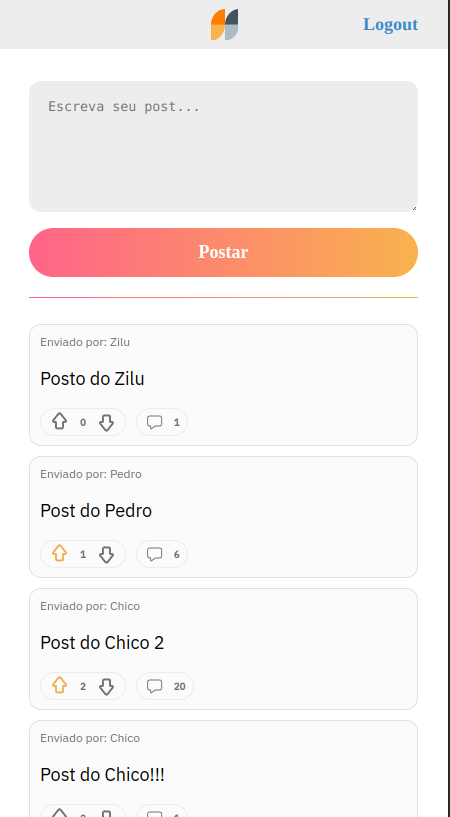
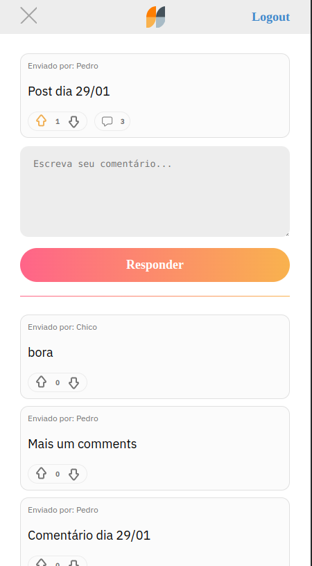

<h1 align="center">Projeto Labeddit Frontend</h1>

## Índice

- [Link de Acesso](#Link-de-Acesso)
- [Resumo do Projeto](#Resumo-do-projeto)
- [Definição do Produto e Funcionalidade](#Definição-do-Projeto-e-Funcionalidade)
- [Instalação](#Instalação)
- [Iniciando](#Iniciando)
- [Lista de Requisitos](#Lista-de-Requisitos)
- [Tecnologias e Ferramentas Utilizadas](#Tecnologias-e-Ferramentas-Utilizadas)
- [Protótipo](#Protótipo)
- [Requisitos do Projeto](#-Requisitos-do-projeto)

## Link de Acesso

Link surge: [projeto-labeddit](https://labeddit-frontend-six.vercel.app/)

## Resumo do Projeto

LabEddit é um projeto web full stack, desenvolvido com um design de aplicativo mobile first que permite a interação entre usuários por meio de postagens, comentários e votos. Os usuários também podem alterar apelido, senha e imagem de avatar, além de deletar suas próprias postagens e comentários.

## Definição de Produto e Funcionalidade

O projeto Labeddit possui quatro páginas:

### Página de Login

Na página de login é possui digitar seu e-mail e sua senha cadastrada e entrar no sistema. Caso ainda não tenha um e-mail/senha cadastrado no sistema, clique no botão crie uma conta! e será direcionado para a página de cadastro.

### Página de Cadastro

Nessa página o usuário pode criar sua conta fornecendo apenas um apelido, e-mail e senha. Sendo necessário concordar com os termos de política de privacidade. Caso haja algum erro o usuário será notificado. Ao realizar seu cadastro com sucesso o usuário é direcionada para a página de posts.

### Página de Post

Em post o usuário vai encontrar uma caixa de texto para criar seu próprio post, é nesta página que ficam todas as postagens dos demais usuários nas quais é possível dar like ou dislike.
Ainda nessa página se o usuário desejar ver os comentários de um post é clicando no ícone de comentário que será redirecionada para a página de comentários.
Há a possibilidade de fazer o Lougout clicando no botão superior direito.

### Página de Comentários

Na página de comentários você pode dar like ou dislike nos comentários dos demais usuários. É possível também adicionar o seu próprio comentário, além disso, para melhorar a experiência do usuário a página possui um botão para retornar para a página de posts. Ou se preferir fazer o logout do sistema clicando no botão superior direito.

## Instalação

- Node.js
- npm

Para instalar as dependências no diretório do seu projeto, execute o seguinte comando:

- npm install

## Iniciando

Para iniciar o aplicativo, execute o seguinte comando:

- npm start

## Tecnologias e Ferramentas Utilizadas

Este site foi construído com as seguintes tecnologias:

- Javascript
- TypeScript
- React
- Figma
- CSS Modules Stylesheet

## Protótipo

O Design de app mobile first foi fornecido pela Labenu, se preferir acesso direto pelo Figma clique [aqui](https://www.figma.com/file/Ks2VBBhW0tN4p9g2ZtZtXE/Projeto-Integrador-Labeddit?type=design&node-id=0%3A1&mode=design&t=2qjhW6dWtWzmEM15-1)\*\*, ou então acompanhe as imagens abaixo:

### Login

### Signup

### Post

### PostComment

## Requisitos do Projeto

- [✔️] Respeitar o layout do Figma
- [✔️] Uso do ReactJS
- [✔️] Site deployado
- [✔️] Documentação README
